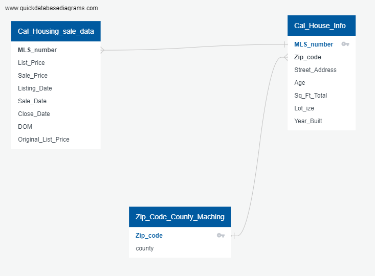

# Housing Price analysis in CA (Final_Group_Project) 

In this folder, we have:

*
*

*<a href="Final_data_processing.ipynb" target="_blank">Final_data_processing.ipynb</a>: this has the code of how we process data

*<a href="Regression_Basic.ipynb" target="_blank">Regression_Basic.ipyng</a>: starting to build a Multiple Linear Regression model

*<a href="Final_Regression.ipynb" target="_blank">Final_Regression.ipynb</a>: this is the final result of the regression model

*<a href="Regression_vs_DeepLearning.ipynb" target="_blank">Regression_vs_DeepLearning.ipynb</a>: begin to explore the Neural Network

*<a href="Final_Regression_NN.ipynb" target="_blank">Final_Regression_NN.ipyng</a>: merge both Regression and Neural Network for comparison. This should be the final product of coding and analysis

= = = = = = = = = = = = = = = = = = = = = = = 
•	Roles and Responsibilities:
*   Presentation : Mikhail Zaatra
*   GitHub: Srividhya Thirumalairajan
*   Machine Learning Model : Trong-Quyen Nguyen, Srividhya Thirumalairajan & Mikhail Zaatra
*   DataBase: Dawit Alaro & Trong-Quyen Nguyen
*   DashBoard: N/A 

