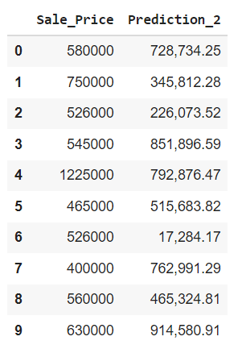
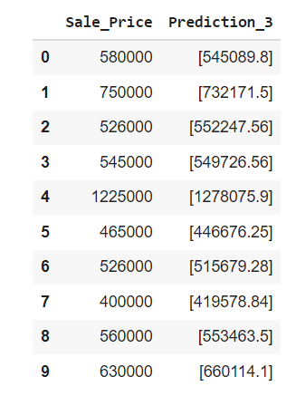
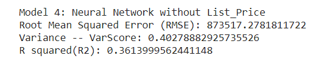
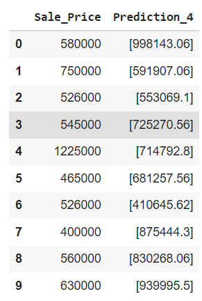
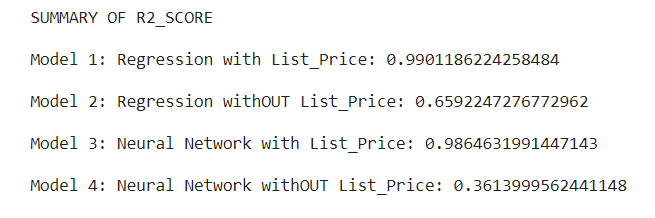

# Housing Price analysis in CA (Final_Group_Project) 

# Predicting CA Housing Prices  
In this project, we will Predict the average housing prices per SQF for each county in CA. Then we will Visualize the housing prices per county on a Map. 
We will build Machine Learning Models to help investors and homeowners assess the housing prices in California based on Housing transactions. We will build a  supervised neural network machine learning model using the following independent parameters, Zip Code, House Age, SQFT, and Days on Market.

## Data Source
1) MLS Data, https://pro.mlslistings.com/, is deposited at "amazonaws.com" with the name 'big_main.csv". The dataset includes 4344 housing sale transactions in California for the period from 6/2020 till 6/2021. The dataset includes Street_Address	City, Zip_Code, SqFtTotal, Lot_Size, Age, BathsTotal, BedsTotal, BathsFull, BathsHalf, DOM, Year_Sold, Year_List, List_Price, Sale_Price, Listing_Date, Sale_Date, Year_Built. 

2) Additional Data set includes "county_zipcode.csv" which was deposited at "amazonaws.com". This files lists all the Zip Codes to County Name. It is from <a href="https://data.chhs.ca.gov/dataset/ead44d40-fd63-4f9f-950a-3b0111074de8/resource/ec32eece-7474-4488-87f0-6e91cb577458/download/covid19vaccinesbyzipcode_test.csv" target="_blank">California Health and Human Services Open Data Portal</a>

## Questions we Hope to answer:
Motivation, Housing prices are a hot topic, especially During the COVID-19 Pandemic (Leading to increased demand for housing). We strive to build a Machine learning model to Guide investors, Potential Buyers, or Real estate professionals on housing prices per county. 
    1. we Will Build a supervised Neural Machine learning model using  House Age, SQF, Lot size & Days on the Market to predict the median House Price per SQF for the county. 

## Communications Protocols:
o	Members: Trong Quyen, Srividhya Thirumalairajan, Dawit Alaro, Angelica Villanueva & Mikhail Zaatra

##    Segment 1:
• Roles and Responsibilities:
    o	Presentation : Mikhail Zaatra
    o	GitHub: Srividhya Thirumalairajan
    o	Machine Learning Model : Trong Quyen , Angelica Villanueva,  Srividhya Thirumalairajan & Mikhail Zaatra
    o	DataBase: Dawit Alaro  & Angelica Villanueva
    o	DashBoard: N/A 
    
• Project Tools: Collaboration: 
    o	Communication Methods: 
    o	GitHub will be the Main tool for Documents and Code Development. 
    o	- Sharing resources via slack
    o	- using zoom meeting every Thursday as well from 7-9 to work on the project
    
##    Segment 2:

•	Final_data_processing.ipynb:
*   Use google Colab and pyspark, and process this online
*   Combine two data sources mentioned above "big_main.csv" and "county_zipcode.csv"
*   Use "StringIndex" from 'pyspark.ml.feature import' to assign a county name a number
*   Joined two data sets together.  Cleaned up and deleted null values.  
*   Export the data to postgresql.  There are three sets of data exported: 'house_data.csv', 'sale_data.csv' and 'final_data.csv'.  

•	Regression_Basic.ipynb
* 	Read the 'final_data.csv' from AWS
*   The data has 4225 records. That amount is split 95% for training and 5% for testing.
*   That split means 4013 records are for training and 212 records for testing 
*   The result is impressive, with R squared is 95%.  The model can explain 95% of the price variation.  
*   The coefficients for the colums "County_Index|SqFtTotal|Lot_Size|Age|BathsTotal|BedsTotal|BathsFull|BathsHalf|DOM|Year_Sold|List_Price" is below:  
*   With this, one can build an estimate calculator.
*   With the coefficients above, we applied the coefficient to all the sales, and created a new column "Predicted Value".
*   "final_data.csv" with an extra column of "Predicted Value" is saved as "final_prediction_all.csv". This "final_prediction_all" will be used for mapping and visualization.

##    Segment 3:

### Final_Regression_NN.ipynb
*   This file is considered "final" because this file is a merge of Regression and Neural Network models together in one file
*   The purpose is to force two models to accept the same number of X_train, y_train, X_test, and y_test data points
*   This final file is even further broken down into 4 models: Regression with List_Price, Regression without List_Price, Neural Network with List_Price, and Neural_Network without List_Price.

#### 1.  Model 1: Regression with List_Price
*   We have a list of coefficients. The List_Price is highly correlated with the Sale_Price, the model independent variable.
 
*   We have some metrics for model 1.  The R2_squared is 99%
 
*   Here is an example how model 1 predicts:
 
*   Here is the plot of the model 1 residuals
 
*   The prediction price plot can tells how closely model 1 predicts its Sale_Price
 

#### 2.  Model 2: Regression without List_Price
*   We have a list of coefficients for model 2.  There is no coefficient for List_Price
 
*   Notice how the r2_square drops significantly to 65%. This means that model 2 can only predict 65.9% of the sale_price accurately.
 
*   Look at how well apart model 2 predicts Sale_Price
 
*   Take a peak at the model 2 residuals plot:
 
*   As expected, model 2 prediction is not as accurate as model 1
 

#### 3.  Model 3: Neural Network with List_Price
*   Model 3 neural network deploys three hidden layers of "relu" with 15, 20, 10 neurons respectively.  The final layer activation is "linear". This model uses optimizer='Adam', loss='mean_absolute_error', metrics=['MSE'].
*   Notice how the value or R2_squared is pretty good at 98%
 
*  Here is the sale price examples of model 3; see column "Prediction 3"
 
*   As expected, model 3 is pretty good at predicting the Sale_Price
 

#### 4.  Model 3: Neural Network with List_Price
*   Model 4 is exactly the same as model 3; it deploys three hidden layers of "relu" with 15, 20, 10 neurons respectively.  The final layer activation is "linear". This model uses optimizer='Adam', loss='mean_absolute_error', metrics=['MSE'].
*   One big difference is that it has no input of "List_Price"
*   Notice how the value or R2_squared is pretty good at 98%
 
*  Column "Prediction 4" lists the prediction of model 4.  Amazingly, it is far from the true Sale_Price.
 
*   As expected, model 4 is amazingly not accurate.
 

#### 4.  Conclusion
 

*   With "List_Price" both Regression and Neural Network has a high r2_squared scores.  Without the "List_Price", Regression (model 2) model does a better job at prediction the "Sale_Price" than the Neural Network (model 4).
*   So, what is the role of "List Price"? First, take a look at the original data
 
*   The data has lot of **QUANTITATIVE** parameters: SqFtTotal, Lot_Size, Age, BathsTotal, BedsTotal, BathsFull, BathsHalf, DOM, Year_Sold.  But it lacks the *"qualitative"* parameter.  Two houses of the same size, build the same year in the same neighborhood can have them constructed with different *quality"; for example, vinyl vs tile.
*   While "List_Price" is highly correlated with the "Sale_Price", in this analysis, List_Price serve as the **ONLY** quality variable.  Sellers tend to ask for a higher price if the house has been remodeled recently.

•	Roles and Responsibilities:
*   Presentation : Mikhail Zaatra
*   GitHub: Srividhya Thirumalairajan
*   Machine Learning Model : Trong Quyen , Srividhya Thirumalairajan & Mikhail Zaatra
*   DataBase: Dawit Alaro  & Angelica Villanueva
*   DashBoard: N/A 

